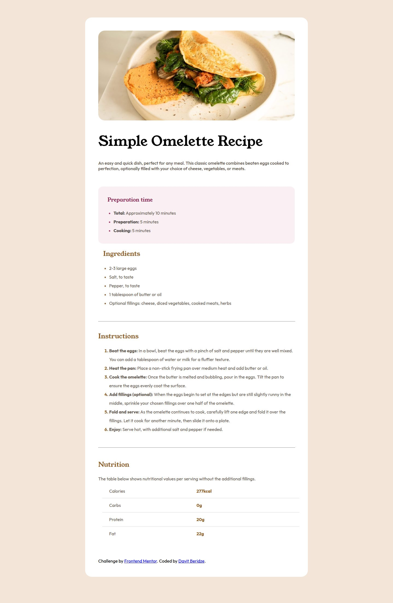
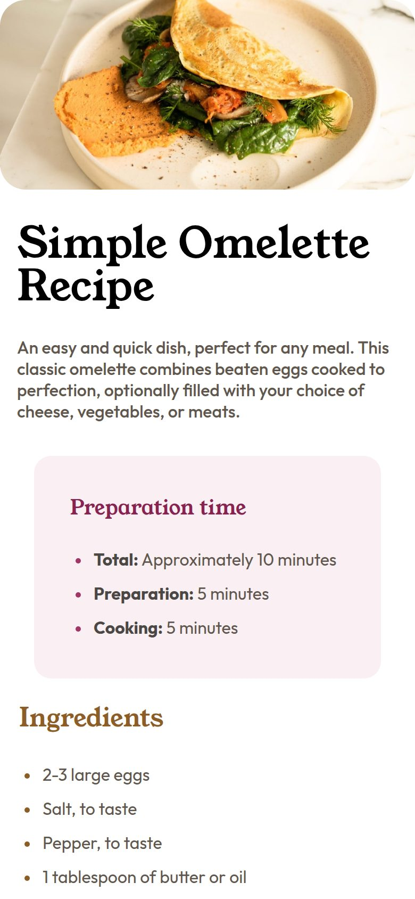

# Recipe Page

My solution to the [Recipe page](https://www.frontendmentor.io/challenges/recipe-page-KiTsR8QQKm) challenge on Frontend Mentor. A recipe page for a simple omelette, with preparation times, ingredients, steps, and nutrition facts.





## Features

- Preparation time, ingredients list, and numbered instructions
- Nutrition section
- Full-width image and no card margins on mobile

## Built with

- Semantic HTML with ordered and unordered lists
- CSS with media queries
- Outfit and Young Serif fonts, self-hosted

## Run locally

No build step or dependencies. Open `index.html` in a browser, or serve the folder:

```bash
npx serve .
```
